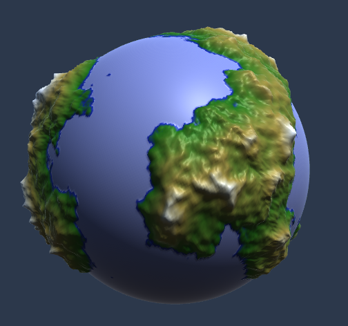

# procedural planet generator
procedurally generated 3D planets, implemented in Unity  
scripts adapted from Sebastian Lague's excellent tutorial series on procedural planets (https://github.com/SebLague/Procedural-Planets)  

## Project Structure

```
├── auxiliary
│   └── external
│       ├── editor
│       │   ├── ConditionalHideAttribute.cs
│       │   ├── ConditionalHidePropertyDrawer.cs
│       │   └── PlanetEditor.cs
│       ├── maths
│       │   └── MinMax.cs
│       └── noise
│           └── Noise.cs
├── features
│   ├── colour
│   │   ├── generator
│   │   │   ├── ColourGenerator.cs
│   │   │   └── ColourSettings.cs
│   │   └── shader
│   └── shape
│       ├── generator
│       │   ├── ShapeGenerator.cs
│       │   └── ShapeSettings.cs
│       └── noise
│           ├── INoiseFilter.cs
│           ├── NoiseFilterFactory.cs
│           ├── noisefilters
│           │   ├── ridgeNoise
│           │   │   └── RidgeNoiseFilter.cs
│           │   └── smoothNoise
│           │       └── SmoothNoiseFilter.cs
│           └── NoiseSettings.cs
└── main
    ├── Planet.cs
    └── Sphere.cs

```

### main 
functions that implement planet object 
* **main/Planet.cs**  
defines planet object 
* **main/Sphere.cs**   
defines a sphere, consisting of six faces 

### auxiliary 
functions that implement various helper routines
*  **external/editor**  
GUI elements 
*  **external/maths**    
guess what..
*  **external/noise**    
noise generators (currently only simplex)

### features 
functions that implement parametrised feature dimensions,  
such as colour and shape 


## Example 
Here's an example with several layers of noise and a custom colour gradient:

